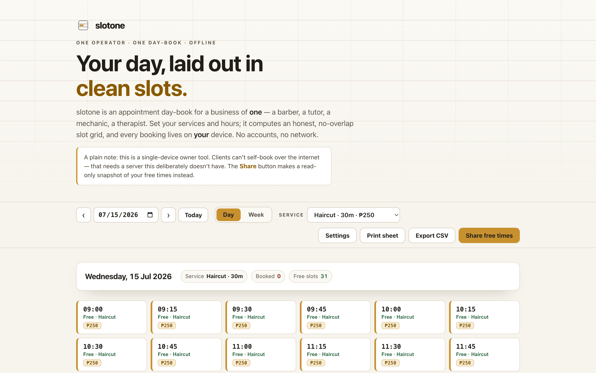

# slotone

**A booking day-book for a business of one.** slotone is a single-device appointment book for solo operators — a barber, a tutor, a mechanic, a therapist. You define your services and hours; it computes an honest, no-overlap slot grid, books appointments into a local day-book, prints a day sheet, and exports CSV. 100% client-side, zero dependencies, works fully offline.

## Why

Full booking platforms are overkill — and overpriced — for one person who just wants to keep a clean day-book and stop double-booking themselves. Paper diaries can't do slot math (does a 45-minute service still fit before 5pm with a 10-minute cleanup buffer?), and the big SaaS tools want an account, a monthly fee, and your clients' data in someone's cloud.

slotone does the one thing that's genuinely fiddly to do by hand — **generate a correct, conflict-free slot grid** — and nothing else. It runs in your browser, keeps everything on your device, and never phones home.

## What it does

- **Services** — name, duration, price, and a colour for each service you offer.
- **Working hours** — per weekday, plus a slot interval and a buffer after each appointment.
- **Days off & blocks** — mark a whole date off (holiday) or carve out a time range (a lunch, a dentist run).
- **Computed slot grid** — for any date, slotone shows exactly which start times are bookable for the selected service, respecting its duration, the buffer, existing appointments, and blocks. There's a **Day** view and a **Week** view.
- **Book it** — tap a free slot, add the client's name and a note; it lands in your local day-book.
- **Printable day sheet** — a clean black-and-white sheet for the counter or the wall.
- **Export CSV** — every booking as an RFC-4180 CSV you can open in any spreadsheet — and your backup.
- **Share free times** — generate a read-only snapshot of when you're open, copy it as text or print it, and send it to a client so they can pick a time and message you.

## The honest limitation (read this)

**slotone is a single-device *owner* tool. Your clients cannot self-book over the internet.**

Real two-sided self-booking needs a server that both you and your client can reach at the same moment, so the server can hold the one source of truth and reject conflicts. slotone deliberately has **no backend** — that's what keeps it free, private, and offline. So:

- The **day-book lives only in this browser, on this one device.** It does not sync. A different phone or laptop won't have it.
- The **Share** feature is a *snapshot*, not a live page. It shows your free times as of the moment you make it and gives clients a way to reach you — they message you, and you do the booking.
- There are **no reminders, no notifications, no payments.** It's a diary that does slot math well, not a scheduling service.

If you outgrow that, you want a hosted booking product. slotone is for the operator who wants a fast, private day-book and total control of their data.

## Quickstart

Just open `index.html` in any modern browser — no build step, no server, no install.

- **Local:** double-click `index.html`, or run a static server in the folder.
- **Hosted:** **[Open slotone live](https://sreenivas-sadhu-prabhakara.github.io/slotone/)**

Open **Settings** to set your business name, hours, services, and blocks. Then pick a date and a service and start booking. Everything saves to your browser's local storage as you type.

## How the slot math works

A start time is offered as **free** only when all of these hold:

1. The appointment `[start, start + duration)` fits inside that weekday's working hours.
2. `[start, start + duration + buffer)` does **not** overlap any existing appointment's reserved span `[existing.start, existing.end + buffer)`.
3. `[start, start + duration)` does **not** overlap any blocked range (a whole-day block counts as `00:00–24:00`).

Overlap is **half-open**, so an appointment ending at 10:00 and one starting at 10:00 never conflict. The same rule is re-checked at the moment you confirm a booking, so a slot can never be double-booked. These pure functions (`generateSlots`, `canBook`, `overlaps`) were unit-tested during development.

## Privacy

slotone is built to be trustworthy with your clients' names.

- A strict Content-Security-Policy sets `connect-src 'none'`: the app **cannot** make any network request even if it tried.
- No external fonts, scripts, images, or analytics. Everything is self-contained.
- All logic runs in your browser. Nothing about your schedule or clients is ever transmitted or stored anywhere but your own device.
- Because there are no network dependencies, it works with **no signal at all**.

Because storage is local only, **keep CSV backups** — clearing your browser data, or switching device or browser, means the day-book is gone.

## Disclaimer

slotone is a personal scheduling utility provided for convenience only. It is a single-device tool with no backend: it cannot let clients self-book, cannot sync across devices, cannot send reminders, and stores data only in this browser, which can be cleared at any time. It is **not** a booking service and makes no guarantee against missed, double, or lost bookings — always confirm appointments directly with your clients and keep your own records. This software is provided under the MIT License, "as is", without warranty of any kind; the author accepts no liability for any loss or damage arising from its use.

## License

[MIT](./LICENSE) © 2026 Sreenivas Sadhu Prabhakara
